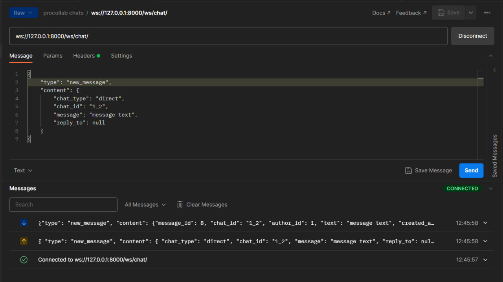

# Документация по вебсокетам чатов

## Общая инфа
URL для всего вебсокет-релейтед - `/ws/`

В данный момент есть только 1 Consumer (т.е. View, но для вебсокетов). Это ChatsConsumer, живет на `/ws/chats/`.

## ChatsConsumer
`/ws/chats/`

### Подключение
Чтобы законнектиться, укажите в хедерах авторизацию по Bearer токену (как и для всех других запросов в REST API).

### Events
Есть два типа ивентов, которые можно кидать - general events и chat-related events. Первые состоят только из user_online и user_offline, вторые содержат все остальное: новое сообщение, печатание, чтение и удаление (пока без редактирования)

Структура любого Event, который должен кидаться на вебсокет выглядит так:
```py
class Event:
    type: EventType
    content: dict
```
И соответсвенно EventType вот такой:
```py
# эти строки указывать в {"type": event_type}

class EventType(str, Enum):
    # CHATS RELATED EVENTS
    NEW_MESSAGE = "new_message"
    DELETE_MESSAGE = "delete_message"
    READ_MESSAGE = "message_read"
    TYPING = "user_typing"

    # GENERAL EVENTS
    SET_ONLINE = "set_online"
    SET_OFFLINE = "set_offline"
```

#### General events

- EventType.SET_ONLINE
- EventType.SET_OFFLINE

Структура этих event'ов одинаковая. 

```json
{
	"type": "set_offline",
	"content": {
		
	}
}
```

#### Chat-related events

##### EventType.NEW_MESSAGE

```json
{
	"type": "new_message",
	"content": {
		"chat_type": {{"direct" | "project"}},
		"chat_id": {{"id1"_"id2"}}, // например: 1_2
		"message": {{string}},
		"reply_to": number | null
	}
}
```



##### EventType.TYPING

```json
{
	"type": "typing",
	"content": {
		"chat_type": {{"direct" | "project"}},
		"chat_id": {{"id1"_"id2"}}, // например: 1_2
	}
}
```

##### EventType.READ_MESSAGE

```json
{
	"type": "typing",
	"content": {
		"chat_type": {{"direct" | "project"}},
		"chat_id": {{"id1"_"id2"}}, // например: 1_2
		"message_id": {{number}}
	}
}
```

##### EventType.DELETE_MESSAGE

```json
{
	"type": "typing",
	"content": {
		"chat_type": {{"direct" | "project"}},
		"chat_id": {{"id1"_"id2"}}, // например: 1_2
		"message_id": {{number}}
	}
}
```
